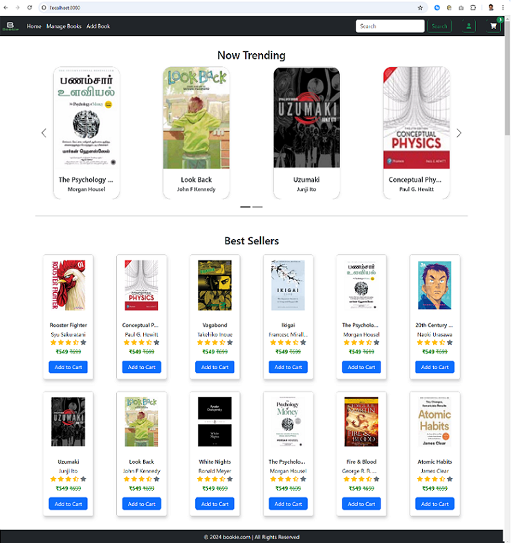
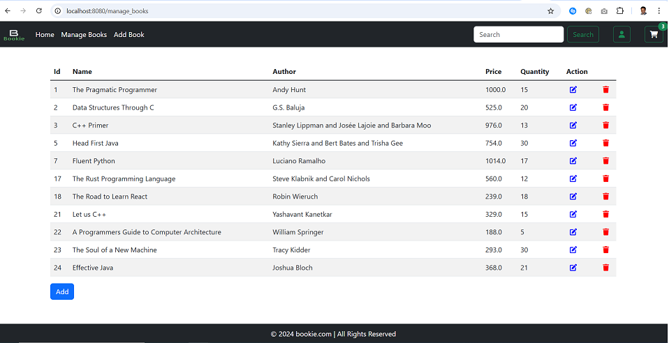

# Online Book Store

A user-friendly web application to manage an onbline book store. This project is aimed to guide students/beginners to develop a quick, simple web application using Java based technologies. Refer to the [Technologies](#technologies) section to know the technologies used.

This application helps to add, edit, delete, list & search books. It lists the available books and provides an option to edit or delete them and add new ones. Provides an intuitive search to search by a keyword.

Backend is developed using Java & Spring Boot framework based on Controller-Service-Repository pattern. Frontend is developed using HTML, CSS, Thymeleaf & aided by Bootstrap & Font Awesome. Database is managed by MySQL.

----

## Table of Contents

1. [Technologies](#technologies)
2. [Getting Started](#getting-started)
3. [Deployment](#deployment)
4. [Enhancements](#enhancements)
5. [Authors](#authors)
4. [License](#license)
5. [Coordinates](#coordinates)

----

## Technologies

### Back End
1. Java (17) 
2. Spring Boot
3. Spring MVC
4. JPA (Hibernate)
5. JDBC

### Front End
1. HTML
2. CSS
3. Thymeleaf

### Database
1. MySQL

----

## Getting Started

These instructions will get you a copy of the project up and running on your local machine for development and testing purposes. See [Deployment](#deployment) section for notes on how to deploy the project on a live system.

### Prerequisites

1. Install Eclipse EE version (https://www.eclipse.org/downloads/)

2. Install MySQL Community version (https://dev.mysql.com/downloads/installer/)
   Install the server, workbench & command line client
   
3. Install Postman(https://www.postman.com/downloads/)

### Setup

Step 0: Open Eclipse Enterprise edition.

Step 1: Click On File > Import > Git (type Git in search bar) > Projects From Git (with smart import) > Clone URI > Paste The Repository URI as: https://github.com/goutham-j/bookstore.git > Select Main Branch > Select Destination Directory > Finish.

Step 2. Open MySQL Workbench tool, use the Command Window and execute all the SQL commands listed in "DATABASE.MD". 
	Note: You should see the "DATABASE.MD" file on the root folder of this project. Once all SQL commands are executed, you should be able to 	view the "bookstore" schema, "book" table & the other book records you created in the MySql database.

Step 3. Go inside src/main/resources > application.properties and update the below database details
	spring.application.name=bookstore
	spring.datasource.driver-class-name=com.mysql.cj.jdbc.Driver
	spring.datasource.url=jdbc:mysql://localhost:3306/bookstore
	spring.datasource.username=root
	spring.datasource.password=<your root password>
	spring.jpa.show-sql=true
	spring.jpa.hibernate.ddl-auto=update

----

## Deployment

### How to Run

Step 1. Select the "BookstoreApplication.java" file under "com.webapp.bookstore" folder, right click and "Run As->Java Application". 

Step 2. On the Console window in the bottom, you should see various starter messages and finally a message like, "Started BookstoreApplication in x.yyy seconds"

### How to Test

Step 1. Open any browser(e.g Chrome) and enter http://localhost:8080/ 

Step 2. You should see the "Online Bookstore" application. Below are the screenshots,

Step 3. Click on "Home", "Manage Books", "Add Book" or "Search" to check various functionalities.

----

## Enhancements

This application can be enhanced with the following features,

* User Management - Add different user roles and the ability to add, delete & manage users. 
* Cart - Ability to add quantities of books to cart to purchase
* Payments - Ability to checkout, make payments & buy books
* Recommendations - Based on user preference & genre, can recommend suitable books
* Dashboard - Dashboard to provide various statistics on users, usage & books

----

## Authors

* **Goutham J**

----

## License

----

## Coordinates

- **Git Hub**: (https://github.com/goutham-j)
- **LinkedIn**: (https://www.linkedin.com/in/gouthamjames/)

----
